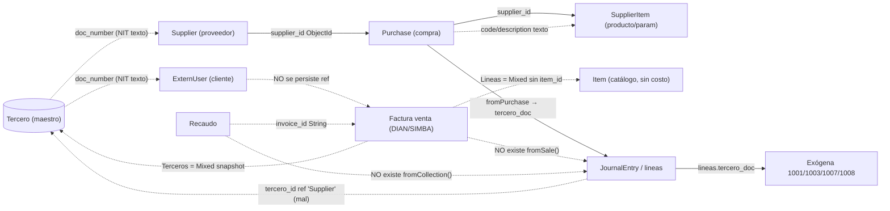

# Diagnóstico — ¿Está todo relacionado alrededor del tercero?

> Verificación intensa sobre el código real de `MC-TECNOTICS-FACTURACION`, cruzando tres ejes: **(1)** lo que dice el libro *Fundamentos de Contabilidad Financiera*, **(2)** lo que tenemos hoy con **SIMBA y la importación DIAN**, y **(3)** los **costos**. Verificado por inspección directa + workflow de 4 rastreadores. Cada afirmación cita archivo:línea.

---

## Veredicto en una frase

**El sistema NO gira hoy alrededor del tercero como debería.** Está conectado **solo del lado de compras/pagos** (Proveedor → Compra → producto parametrizado → asiento → exógena, todo por NIT). El **lado de ventas está desconectado de la contabilidad**, y **no existe noción de costo ni de inventario**, por lo que el principio del libro —*ventas = ingresos, compras = egresos, costo de ventas, todo por tercero*— **se cumple a medias**.

---

## Eje 1 — El principio del libro vs. lo que tenemos

El libro (Unidad 8 p.90, Unidad 13 p.134) establece el ciclo completo:

```
VENTA  →  D Cliente/Banco + D Costo de ventas / C Ingreso + C IVA gen + C Inventario
COMPRA →  D Inventario/Gasto + D IVA desc / C Proveedor
         (Utilidad bruta = Ventas − Costo de ventas)
```

| Lo que exige el libro | ¿Lo tenemos? | Evidencia |
|---|---|---|
| Compra genera asiento (egreso) | ✅ Sí | `Posting.service.ts:121` `fromPurchase` |
| Pago a proveedor genera asiento | ✅ Sí | `Posting.service.ts:217` `fromPayment` |
| **Venta genera asiento (ingreso)** | ❌ **No** | `Facturas.service.ts` no importa Posting/Ledger |
| **Recaudo genera asiento** | ❌ **No** | `Recaudos.service.ts` no importa Posting/Ledger |
| **Costo de ventas (D 6135 / C 1435)** | ❌ **No** | no existe costo ni inventario |
| **Utilidad bruta = Ventas − Costo** | ❌ **No** | imposible sin lo anterior |
| Todo movimiento ligado al tercero | ⚠️ Parcial | solo compras llevan `tercero_doc` |

---

## Eje 2 — SIMBA e importación

**SIMBA es solo el broker fiscal con la DIAN**, no toca la contabilidad:
- `Simba.service.ts:14` `emitirFactura` → POST a SIMBA, devuelve CUFE/estado. `emitirNomina` igual (CUNE).
- `Facturas.service.ts createFacturaNewMethod`: arma el XML DIAN, lo emite por SIMBA, guarda `FacturaModel` **y termina ahí**. No genera asiento, no descuenta inventario, no registra costo. **La factura de venta es un documento fiscal puro, desacoplado del libro contable.**

**Importación de compras (XML/ZIP DIAN)** — este lado **sí** está bien anclado:
- `parseDianXml` extrae `supplier_nit`, `cufe`, `subtotal`, `iva_total`, `lines[]`.
- Crea/empareja `Supplier` por NIT, crea `SupplierItem` por cada código, y **causa el asiento CC** con `fromPurchase` (con distribución por producto + retenciones). El proveedor llega a la contabilidad por `tercero_doc`.
- **Asimetría clave:** lo que entra (compras) se contabiliza; lo que sale (ventas por SIMBA) no.

---

## Eje 3 — Costos (el hueco más grande frente al libro)

- `items.model.ts`: el catálogo guarda **`price` (venta), NO guarda costo**. No hay `cost_price`.
- **No existe ningún módulo de inventario / kardex / stock** en todo el backend (grep exhaustivo: 0 resultados reales).
- `AccountingConfig` tiene `cuenta_gasto_costo` (compras) pero **no `cuenta_inventario` ni `cuenta_costo_ventas`**.
- → El "Costo de ventas" y la "Utilidad bruta" del libro (p.134) **son imposibles de calcular hoy**. La rentabilidad solo se podría aproximar por contabilidad global (clase 4 vs 6), no por producto ni por venta.

---

## Mapa de relaciones REALES (verificado)

| Desde | Hacia | Campo | Tipo | ¿Existe? | Evidencia |
|---|---|---|---|---|---|
| Tercero | ExternUser (cliente) | `doc_number` | NIT texto, sin FK | ⚠️ parcial | `extern-user.model.ts:9` (sin `tercero_id`) |
| Tercero | Supplier (proveedor) | `doc_number` | NIT texto, sin FK | ⚠️ parcial | maestros paralelos por NIT |
| ExternUser | Factura | — | **SIN relación** | ❌ no | `factura.model.ts` sin `client_id`/`tercero_id` |
| Factura | Tercero | `Terceros` (Mixed) | snapshot NIT | ⚠️ parcial | `factura.model.ts:9` Mixed (copia, sin `_id`) |
| Supplier | Purchase | `supplier_id` | **ref ObjectId** | ✅ sí | `purchase.model.ts:23` |
| Purchase.lines | SupplierItem | `(code\|\|description)` | **cruce por texto** | ⚠️ frágil | `SupplierItems.service.ts:135-137` |
| Purchase.lines | Item (catálogo) | `item_id` | ref sin populate | ⚠️ muerta | `purchase.model.ts:13` |
| Factura.Lineas | Item (catálogo) | — | **SIN relación** | ❌ no | `factura.model.ts:10` Mixed sin `item_id` |
| Asiento (JournalLine) | Tercero | `tercero_id` | **ref a "Supplier"(!)** | ⚠️ mal | `ledger.model.ts:8` `ref:"Supplier"` |
| Asiento | Exógena | `lineas.tercero_doc` | snapshot + enrich | ⚠️ parcial | `Dian.service.ts aggByTercero` |
| Factura (venta) | Asiento FV | — | **SIN relación** | ❌ no | `Facturas.service.ts` sin Posting |
| Recaudo | Factura | `invoice_id` | **String, no ObjectId** | ⚠️ frágil | `receipt.model.ts:54` |
| Recaudo | Asiento RC | — | **SIN relación** | ❌ no | `Recaudos.service.ts` sin Posting |



---

## Cobertura COMPLETA por módulo (todos los documentos)

Estado de cada documento del sistema respecto al tercero y a la contabilidad:

| Módulo / documento | Tercero asociado | ¿Cómo se liga al tercero? | ¿Genera asiento? | Estado |
|---|---|---|---|---|
| **Compra / Gasto** | Proveedor | `supplier_id` (ObjectId) + `supplier_doc` snapshot | ✅ CC (`fromPurchase`) | ✅ Completo |
| **Pago a proveedor (lote)** | Proveedor | `supplier_doc` en líneas | ✅ CE (`fromPayment`) | ✅ Completo |
| **Retención (compra)** | Proveedor | `tercero_doc` en líneas | ✅ recontabiliza | ✅ Completo |
| **Depreciación activo** | — (no aplica) | `centro_costo_id` | ✅ DEP | ✅ Completo |
| **Factura de VENTA** | Cliente (`ExternUser`) | `Terceros` (Mixed snapshot NIT) | ❌ **NO** | 🔴 Roto |
| **Recaudo (cobro)** | Cliente | `client_doc` snapshot; `invoice_id` String | ❌ **NO** | 🔴 Roto |
| **NÓMINA** | Empleado | `systemInfo.empleado_id` (String) | ❌ **NO** | 🔴 Roto |
| **Baja/venta de activo** | Comprador (en venta) | **no captura el tercero comprador** | ✅ NC (sin tercero) | 🟠 Parcial |
| **Cotización** | Cliente | `client_id` (String snapshot) | ❌ (correcto: pre-venta) | 🟡 OK por diseño |
| **Remisión** | Cliente | `client_id`/snapshot | ❌ (correcto: no fiscal) | 🟡 OK por diseño |
| **Conciliación bancaria** | — | cuenta banco | ✅ NC ajustes | ✅ Completo |

### Detalle de los que faltan

**NÓMINA (🔴):**
- `Empleado` es único por `(company_id, numero_documento)` pero **NO tiene `tercero_id`** — aunque `Tercero` define el rol `"empleado"`, el empleado vive en su propia tabla sin FK al maestro.
- `Nomina` se liga al empleado por `systemInfo.empleado_id` (id como **String**, no ObjectId con `ref`).
- `Nomina.service` **no importa Posting/Ledger** → emitir nómina (aun aprobada por SIMBA con CUNE) **no genera el asiento NOM**. El costo laboral nunca entra al libro. El libro lo exige: `D 5105 gastos de personal / C 2505 salarios por pagar + C 2370 retenciones + C 2380 aportes`.
- Efecto colateral: el **Formulario 220** que construimos consolida desde el `NominaElectronica` (Mixed) directamente, **no desde la contabilidad** — funciona, pero por la misma razón que la cartera: porque se calcula aparte del libro.

**RECAUDO (🔴):**
- `Receipt` guarda `amount`, `method` (efectivo/transferencia/consignacion/tarjeta/cheque), `client_doc` (snapshot), `invoice_id` (**String**, no ObjectId con `ref`).
- **No tiene `tercero_id`** y **no registra en qué cuenta de banco/caja entró** el dinero (el `method` es texto, no una cuenta contable).
- `Recaudos.service` **no importa Posting/Ledger** → cobrar no genera asiento RC. La cuenta 1305 (CxC) nunca se reduce contablemente.

**BAJA/VENTA DE ACTIVO (🟠):**
- La depreciación y la baja generan asiento correctamente, pero al **vender** un activo **no se captura el tercero comprador**, así que esa venta no aparece por tercero en exógena.

**COTIZACIÓN / REMISIÓN (🟡 — correcto que no contabilicen):**
- Son documentos pre-venta/no fiscales; el libro no exige asiento. Solo conviene que su `client_id` sea ref real a `Tercero` para trazabilidad.

---

## Rupturas priorizadas

- **P0 — Ventas no contabilizan.** No existe `fromSale`. El cliente nunca entra al libro → exógena **1006/1007/1008 ciega** (omisión reportable ante DIAN). Estados financieros sin ingresos → utilidad falsa.
- **P0 — Recaudos no contabilizan.** No existe `fromCollection`. La cartera "real" se calcula aparte leyendo facturas, no del libro (cuenta 1008 vacía). Además `Receipt` no guarda la cuenta de banco donde entró el dinero (solo `method` texto).
- **P0 — Nómina no contabiliza.** No existe `fromPayroll`. El costo laboral, las retenciones y los aportes nunca entran al libro (clases 5/25/23). El F220 funciona solo porque consolida del `NominaElectronica`, no del mayor.
- **P0 — Sin costo ni inventario.** `Item` no tiene costo; no hay kardex; no hay cuenta de inventario/costo de ventas → no hay utilidad bruta.
- **P1 — Cliente/Proveedor/Empleado no unificados con Tercero.** Ni `ExternUser`, ni `Supplier`, ni `Empleado` tienen `tercero_id`; se cruzan por NIT/documento en texto (frágil si difiere formato/DV). Los tres roles del maestro (`cliente`/`proveedor`/`empleado`) existen en `Tercero` pero los documentos apuntan a tablas legacy separadas.
- **P1 — `tercero_id` del asiento apunta a `Supplier`, no a `Tercero`** (`ledger.model.ts:8`). Un cliente no cabe ahí.
- **P2 — Compra→producto por código de texto** sin normalizar (`'001'` ≠ `'0001'` → cae a default sin retención). Genera `SupplierItem` duplicados.
- **P2 — Catálogo `Item` desconectado** de las líneas reales (facturas usan Mixed sin `item_id`).

---

## Plan para cerrar el circuito alrededor del tercero (priorizado)

1. **`PostingService.fromSale()`** + llamarlo al aprobar factura: `D 1305 Cliente + D 6135 Costo / C 4135 Ingreso + C 2408 IVA gen + C 1435 Inventario`, con `tercero_doc`/`tercero_id` del cliente. **Desbloquea 1006/1007/1008 y estados financieros reales.**
2. **`PostingService.fromCollection()`** para recaudos: `D Banco (según método) + D retención sufrida / C 1305 Cliente`, con `tercero_doc`. Mapear cada `method` a una cuenta de caja/banco.
3. **`PostingService.fromPayroll()`** para nómina: al aprobar, `D 5105 gastos de personal / C 2505 salarios por pagar + C 2370 retención + C 2380 aportes`, con `tercero_doc` del empleado. Conecta el costo laboral y el F220 al libro.
4. **Costo + inventario mínimo:** agregar `cost_price` a `Item`, `cuenta_inventario`/`cuenta_costo_ventas` a `AccountingConfig`, y mover inventario en compra (entra) y venta (sale al costo). Habilita la utilidad bruta del libro.
5. **Unificar tercero:** `tercero_id: ObjectId ref "Tercero"` en `ExternUser`, `Supplier` y `Empleado`, poblado al crear; NIT/documento pasa a atributo, no llave.
6. **Corregir `ledger.model.ts:8`**: `tercero_id` debe referenciar `Tercero` (o separar `supplier_id`).
7. **Robustecer cruce producto:** normalizar código (upper + sin separadores) al crear y buscar; preferir `item_id`. Capturar el tercero comprador en la venta de activos.

**Impacto:** los pasos 1-4 son los que hacen que el sistema *realmente* gire alrededor del tercero con ingresos, egresos, costo y nómina —el principio del libro—. Los 5-7 dan integridad y calidad de datos.
