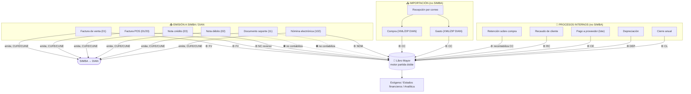
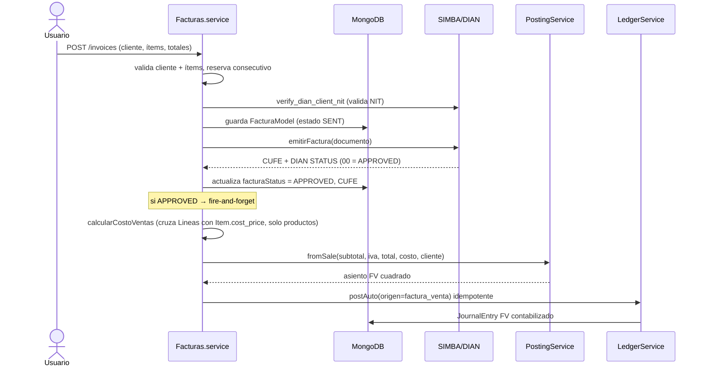
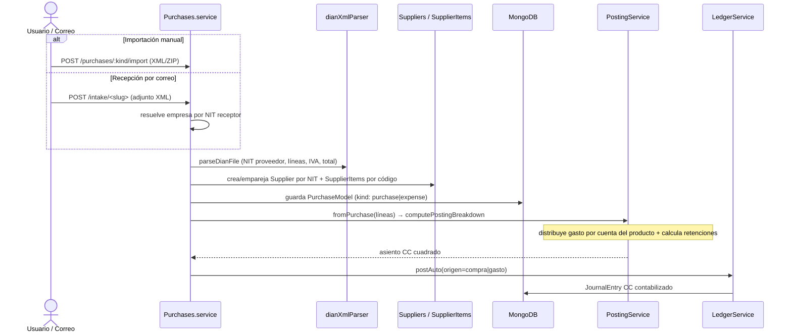
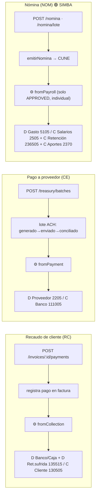
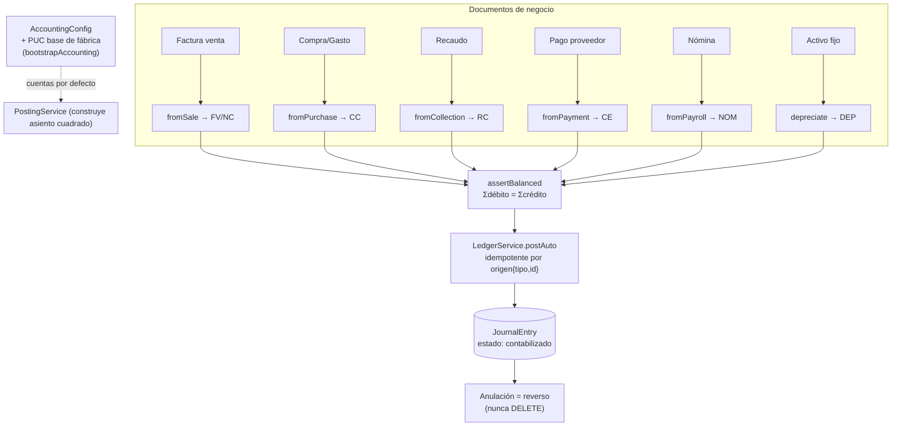

# Mapa completo de procesos — Facturación, SIMBA y Contabilidad

> Verificado sobre el código real de `MC-TECNOTICS-FACTURACION`. Cada documento, qué se emite a SIMBA/DIAN, y qué asiento contable genera. Diagramas en **Mermaid** (pégalos en [mermaid.live](https://mermaid.live), Notion, Obsidian, draw.io o GitHub).
>
> **Convención:** 🟢 va a SIMBA · 🔵 se importa/interno · ⚙️ genera asiento automático · ⛔ no contabiliza.

---

## 1. Panorama general

---

## 2. Flujo de VENTA → SIMBA → asiento (factura 01)

**Asiento FV:** `D 130505 Cliente (total) / C 4135 Ingreso (subtotal) + C 240810 IVA generado`
y si hay productos con costo: `+ D 6135 Costo de ventas / C 1435 Inventario`.

**Nota crédito (03):** mismo flujo, **invierte** el asiento (NC): `D Ingreso + D IVA / C Cliente` (+ inventario regresa).

---

## 3. Flujo de COMPRA / GASTO (importación, no SIMBA)

**Asiento CC:** `D 5135 Gasto (distribuido por producto) + D 240805 IVA descontable / C 2205 Proveedor (neto) + C 236540/2367/2368 Retenciones`.

> ⚠️ **Las compras/gastos NO se emiten a SIMBA**: son facturas que **otros** emitieron y la empresa **importa** (del XML DIAN o por correo). SIMBA solo se usa para EMITIR lo que la empresa vende.

---

## 4. Flujo de RECAUDO / PAGO / NÓMINA

> Recaudos y pagos son **internos** (no SIMBA). La **nómina SÍ se emite a SIMBA** (tipo 102, devuelve CUNE) y luego contabiliza. Las notas de ajuste de nómina (REEMPLAZAR/ELIMINAR) **no** contabilizan automáticamente.

---

## 5. El motor contable (cómo se conecta todo)

**Reglas del motor:**
- **Partida doble:** `assertBalanced` exige Σdébito = Σcrédito.
- **Idempotente:** `postAuto` no duplica el asiento de un mismo `origen` (tipo+id).
- **Inmutable:** anular = crear un reverso enlazado; nunca se borra.
- **De fábrica:** `bootstrapAccounting` siembra PUC base + cuentas por defecto al crear la empresa.

---

## 6. Tabla resumen — acción → SIMBA → asiento → tercero

| Documento | Tipo DIAN | ¿SIMBA? | Asiento | Tercero |
|---|---|---|---|---|
| Factura de venta | 01 | 🟢 CUFE | **FV**: D Cliente / C Ingreso + IVA gen (+ D Costo / C Inventario) | Cliente |
| Factura POS | 01/20 | 🟢 CUFE | **FV** (igual, con centro de costo) | Cliente |
| Nota crédito | 03 | 🟢 CUFE | **NC**: reverso de la venta | Cliente |
| Nota débito | 02 | 🟢 CUFE | ⛔ no contabiliza auto | Cliente |
| Documento soporte | 11 | 🟢 CUNE | ⛔ no contabiliza auto | Proveedor |
| Nómina electrónica | 102 | 🟢 CUNE | **NOM**: D Gasto / C Salarios + Retención + Aportes | Empleado |
| Compra | (importada) | 🔵 no | **CC**: D Gasto + IVA desc / C Proveedor + Retenciones | Proveedor |
| Gasto | (importada) | 🔵 no | **CC** (origen=gasto) | Proveedor |
| Retención sobre compra | — | 🔵 no | recontabiliza CC (C CxP neta + C Retención) | Proveedor |
| Recaudo de cliente | — | 🔵 no | **RC**: D Banco/Caja + Ret.sufrida / C Cliente | Cliente |
| Pago a proveedor (lote) | — | 🔵 no | **CE**: D Proveedor / C Banco | Proveedor |
| Depreciación | — | 🔵 no | **DEP**: D Gasto / C Dep. acumulada | — |
| Cierre anual | — | 🔵 no | **CL**: cancela resultado → 3605/3610 | — |

---

## 7. Puntos a verificar (checklist)

- ✅ Toda venta APPROVED genera asiento FV con el cliente como tercero → exógena de ingresos.
- ✅ Toda compra/gasto importado genera asiento CC con el proveedor como tercero → exógena de pagos.
- ✅ Recaudo reduce la CxC del cliente; pago reduce la CxP del proveedor.
- ✅ Nómina aprobada genera costo laboral con el empleado como tercero.
- ✅ Costo de ventas se registra si el producto tiene `cost_price`.
- ✅ **Nota débito (02)** genera asiento de venta (D Cliente / C Ingreso + IVA). *(cerrado)*
- ✅ **Documento soporte (11)** genera asiento de compra (D Gasto + IVA / C CxP proveedor). *(cerrado)*
- ✅ **Notas de ajuste de nómina** (reemplazar/eliminar) reversan automáticamente el asiento del predecesor. *(cerrado)*
