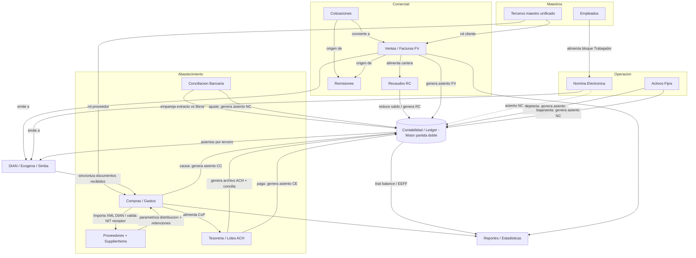
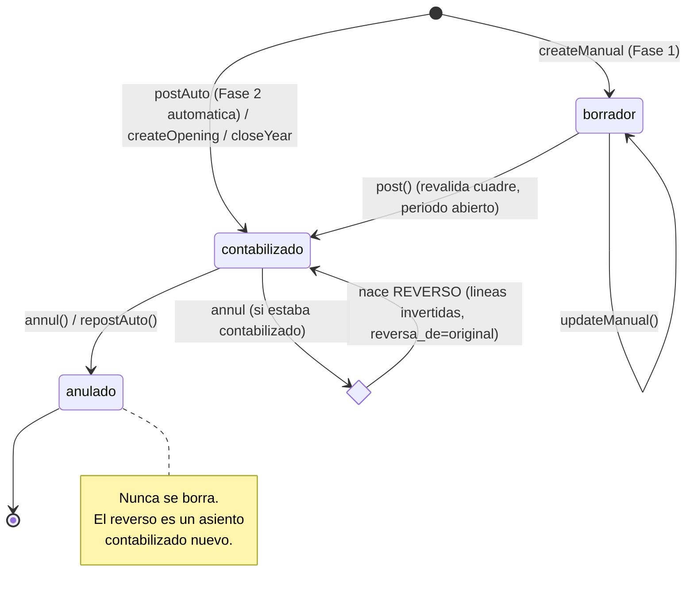
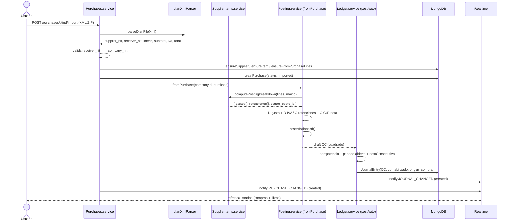
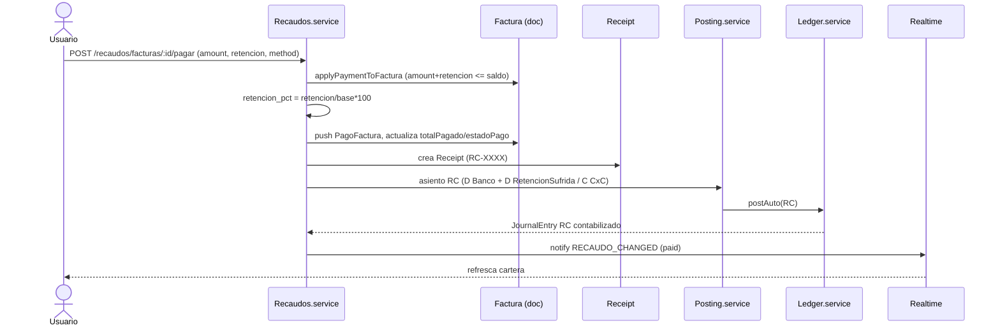
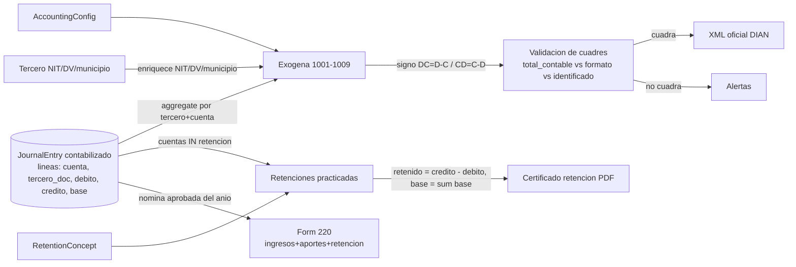
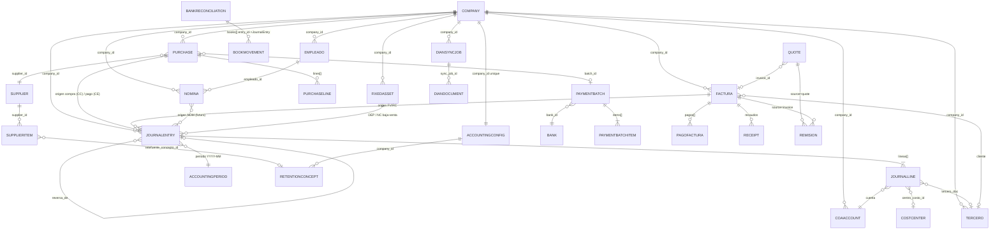

# Mapa de Procesos — Portal Tecnotics

> Documento de referencia de arquitectura y de negocio del Portal de Facturación Electrónica DIAN de Tecnotics, que es además un sistema contable completo. Multitenant por `company_id`. Backend `MC-TECNOTICS-FACTURACION` (Node + Express + Mongoose), frontend `FE_TECNOTICS_PORTAL` (React + Vite), realtime por Socket.IO.

---

## 1. Visión general

### 1.1 Qué es el sistema

El Portal Tecnotics es un **ERP fiscal-contable colombiano** construido alrededor de la facturación electrónica DIAN (vía el broker **Simba**) que cubre el ciclo completo de un negocio: ventas, recaudos, cotizaciones, remisiones, compras/gastos, proveedores, tesorería, conciliación bancaria, nómina electrónica, activos fijos, terceros, contabilidad de partida doble, reportes financieros y reportes tributarios (exógena 1001-1009, retenciones, certificados, Form 220).

Cada empresa es un **tenant** identificado por `company_id`. Todas las colecciones llevan `company_id` y todas las rutas `/v1/` pasan por el middleware `companyAuth` (`src/auth/company.auth.ts`) que extrae el `company_id` y el `simba_token` del JWT y los inyecta en `req.user`.

### 1.2 Capas

| Capa | Tecnología | Responsabilidad |
|------|-----------|-----------------|
| **Frontend** | React + Vite (`FE_TECNOTICS_PORTAL`) | Menú dinámico por rol (`menu.config.ts`), formularios, escucha de eventos socket y refresco de listados |
| **Backend** | Node + Express + Mongoose | Servicios de dominio, motor contable único, integración Simba/DIAN, generación de XML/PDF/ACH |
| **Realtime** | Socket.IO (`src/config/socket.ts`, `src/utils/realtime.ts`) | 13 eventos por tenant; `emitToCompany(companyId, event, payload)` a la sala `company:${companyId}` |
| **Persistencia** | MongoDB | Documentos de negocio + asientos (`JournalEntry`) + maestros |
| **Integraciones externas** | Simba (DIAN), Anthropic (Claude Haiku 4.5 para parametrización IA), Cloudinary (QR/logos) | Emisión electrónica, sugerencias contables, imágenes |

### 1.3 Principio contable rector

> **Todo documento de negocio que tenga efecto económico genera un asiento contable a través de un único motor de partida doble. Nunca se borra un asiento: se reversa.**

Reglas no negociables:

1. **Servicio único de contabilización** (`PostingService` en `src/services/Posting.service.ts`). Ningún módulo escribe asientos directamente: le pasa el documento origen (Fase 2, automático) o un asiento manual (Fase 1) y el servicio produce líneas validadas.
2. **Cuadre garantizado**: `assertBalanced()` exige `Σ débito === Σ crédito` (tolerancia 0 a 2 decimales) y rechaza asientos en cero.
3. **Trazabilidad bidireccional**: cada `JournalEntry` lleva `origen = { tipo, id }` apuntando al documento que lo generó (compra, pago, factura, nómina, depreciación) o a un origen interno (`saldos_iniciales`, `cierre_anual`, `reapertura`).
4. **Idempotencia**: `LedgerService.postAuto()` no duplica el asiento de un origen ya contabilizado (salvo `allowMultiple`).
5. **Inmutabilidad**: una anulación crea un **reverso** enlazado (`reversa_de`) con líneas invertidas y marca el original `anulado`; nunca hay `delete`.
6. **Mejor esfuerzo en automático**: si faltan cuentas en `AccountingConfig` o el período está cerrado, la contabilización automática retorna `null` y **no rompe** el flujo de negocio (la importación de la compra o el pago siguen su curso).

---

## 2. Diagrama de módulos



---

## 3. El motor contable (sección central)

Ubicación: `src/services/Posting.service.ts` (construcción/validación de líneas) y `src/services/Ledger.service.ts` (persistencia, consecutivos, estados, reverso, cierre). Modelos en `src/models/ledger.model.ts` y `src/models/accounting.model.ts`.

### 3.1 Partida doble

Cada `JournalEntry` tiene `lineas: JournalLine[]`; cada línea es **o débito o crédito** (nunca ambos, nunca ninguno). `PostingService.assertBalanced()`:

```
totalDebito = round2(Σ debito)
totalCredito = round2(Σ credito)
if (totalDebito !== totalCredito) -> error 400 "El comprobante no cuadra"
if (totalDebito === 0) -> error 400 "El comprobante no tiene valores"
```

### 3.2 Tipos de comprobante (`JournalType`)

| Tipo | Significado | Generado por |
|------|-------------|--------------|
| **CC** | Causación (compra/gasto) | `PostingService.fromPurchase()` |
| **CE** | Comprobante de egreso (pago) | `PostingService.fromPayment()` |
| **RC** | Recibo de caja (recaudo) | Recaudos (Fase 2 ventas) |
| **FV** | Factura de venta | Facturación (Fase 2, tras APPROVED) |
| **NC** | Nota de contabilidad (manual, ajustes, baja/venta de activos, conciliación) | `createManual()`, `dispose()`, `postAdjustment()` |
| **AP** | Apertura (saldos iniciales) | `createOpening()` |
| **CL** | Cierre anual (cancela resultado) | `closeYear()` |
| **DEP** | Depreciación mensual | `FixedAssets.depreciate()` |
| **NOM** | Nómina | `fromNomina()` (estructura lista) |

### 3.3 Naturaleza por clase del PUC (`CoaAccount`)

`codigo` de 4-8 dígitos; la **clase** es el primer dígito. Solo cuentas `es_movimiento` (auxiliares) reciben asientos.

| Clase | Grupo | Naturaleza (saldo típico) | Aumenta con |
|-------|-------|---------------------------|-------------|
| 1 | Activo | DÉBITO | débito |
| 2 | Pasivo | CRÉDITO | crédito |
| 3 | Patrimonio | CRÉDITO | crédito |
| 4 | Ingresos | CRÉDITO | crédito |
| 5 | Gastos | DÉBITO | débito |
| 6 | Costos de venta | DÉBITO | débito |
| 7 | Costos de producción | DÉBITO | débito |
| 8 | Cuentas de orden deudoras | DÉBITO | — |
| 9 | Cuentas de orden acreedoras | CRÉDITO | — |

Banderas de cuenta que el motor valida en `buildManualLines()`: `estado=ACTIVA`, `es_movimiento`, `maneja_tercero` (exige `tercero_id`), `maneja_centro_costo` (exige `centro_costo_id`), `maneja_base` (base gravable).

### 3.4 `AccountingConfig` (cuentas por defecto por marco)

Un documento por empresa (`company_id` único). `marco ∈ {niif, colgaap, ambos}`. Cada cuenta es un par `{ niif, colgaap }` que `PostingService.pick(pair, marco)` resuelve según el marco activo (con fallback al otro marco si uno falta).

| Campo | Uso en el motor |
|-------|-----------------|
| `cuenta_gasto_costo` | Débito subtotal en `fromPurchase` |
| `cuenta_iva` | Débito IVA descontable en `fromPurchase` |
| `cuenta_por_pagar` | Crédito CxP en `fromPurchase`; débito en `fromPayment` |
| `cuenta_banco` | Crédito en `fromPayment`; cuenta conciliada |
| `cuenta_retefuente` / `cuenta_reteiva` / `cuenta_reteica` | Crédito retenciones practicadas |
| `cuenta_resultado_ejercicio` | Contrapartida del cierre `closeYear` |
| `cuenta_anticipos`, `cuenta_caja_menor` | Otros destinos |

> Si `AccountingConfig` no existe o faltan `cuenta_gasto_costo`/`cuenta_por_pagar`, `fromPurchase()` retorna `null` y la importación continúa (modo best-effort).

### 3.5 `postAuto()` idempotente

`LedgerService.postAuto(draft, origen)`:
1. Verifica idempotencia: si ya existe un asiento **no anulado** para ese `origen` y no se permite `allowMultiple`, no duplica.
2. Valida período abierto (`assertPeriodOpen`).
3. Obtiene consecutivo respetando `blocked_ranges` (`nextConsecutivo()`).
4. Crea `JournalEntry` con `estado=contabilizado`, `origen={tipo,id}`.
5. Emite `JOURNAL_CHANGED` (`action="created"`).

### 3.6 Reverso (nunca borrar)

`PostingService.reverseLines()` intercambia débito↔crédito. Usado en:
- `annul()` — anulación de un asiento contabilizado.
- `repostAuto()` — recálculo (p.ej. al aplicar retenciones a una compra): reversa el previo y posta el nuevo.
- `reopenYear()` — reverso del CL.

El original queda `estado=anulado` (con `anulado_por`); el reverso queda `contabilizado` con `reversa_de = original._id`.

### 3.7 Cierre y apertura

- **Apertura (AP)** — `createOpening()`: saldos iniciales por tercero/documento (CxC/CxP exigen tercero). `estado=contabilizado` directo, `origen.tipo='saldos_iniciales'`. Solo una apertura por empresa (`hasOpening`).
- **Cierre anual (CL)** — `closeYear({anio})`: agrega el **neto crudo** de clases 4,5,6,7 por cuenta (excluyendo CL previos), cancela cada cuenta de resultado contra `cuenta_resultado_ejercicio` (utilidad si predominan créditos → crédito a patrimonio; pérdida si predominan débitos → débito), valida cuadre, crea CL con fecha 31-dic, y **sella los 12 períodos** (`estado=cerrado`). Idempotente: un solo CL por año, requiere diciembre abierto y sin borradores en el año.
- **Reapertura** — `reopenYear({anio})`: reabre los 12 períodos, crea reverso del CL y anula el CL original.

### 3.8 Ciclo de vida de un asiento



---

## 4. Módulos de negocio

### 4.1 Ventas (Facturas FV / Notas Crédito NC=03 / Notas Débito ND=02)

**Entidades** (`src/models/factura.model.ts`):
- `Factura` — encabezado DIAN (`TipoDocElectronico` 01/02/03/11), `PrefijoDocumento+NumeroDocumento` (índice único parcial con `company_id+tipo`), `Terceros`, `Lineas[]`, `Totales.TotalMonetario`, `systemInfo.facturaStatus ∈ {PENDING, APPROVED, REJECTED, SENT}`, `dianDocKey` (CUFE), `is_draft`, `pagos[] (PagoFactura)`, `totalPagado`, `estadoPago`.
- `Nota Crédito` (03) — `IdPersonalizacion` 20/22, `Referencias.ReferenciaFacturacion.Id`; **reduce saldo** de la factura original en cartera.
- `Nota Débito` (02) — `IdPersonalizacion` 30/32, referencia obligatoria.

**Relaciones**: `Factura → ExternUser`/`Tercero(rol cliente)`, `Company` (emisor), `Receipt` (comprobantes de pago).

**Procesos**:

| Proceso | Disparador (endpoint) | Pasos clave | Resultado |
|---------|----------------------|-------------|-----------|
| Emisión factura | `POST /facturas/crear` (`isDraft` true/false) | Validar cliente+empresa → si borrador guardar sin consecutivo → si definitivo `getNextFacturaNumberWithCompany` + XML DIAN + `createFacturaWithConsecutiveRetry` + `sendFacturaToSimba` | `facturaStatus='SENT'` |
| Aprobación DIAN | Webhook Simba / `pollAndUpdateDianStatus` | Consultar por CUFE → APPROVED guarda `dianDocKey` + PDF background; REJECTED guarda `dianStatusDescr` | `facturaStatus=APPROVED\|REJECTED`, emite `INVOICE_CHANGED` |
| Crear Nota Crédito | `POST /facturas/notas-credito` (`createNotaCreditoNewMethod`) | Cargar factura+CUFE (o sin ref) → XML `TipoDocElectronico=03`, `TipoDeNotaCredito=91` → Simba | `Factura` tipo 03; reduce saldo |
| Crear Nota Débito | `POST /facturas/notas-debito` (`createNotaDebitoNewMethod`) | Factura referencia obligatoria → XML tipo 02 → Simba | `Factura` tipo 02 |

**Asiento generado**: tipo **FV** en Fase 2 (tras `APPROVED`):
```
D  Clientes / CxC (130505)            total
   C  Ingresos por ventas (4135xx)         subtotal
   C  IVA generado (240805)                iva
```
La NC genera asiento de signo inverso que reduce ingreso y CxC. Archivos: `Facturas.service.ts`, `Posting.service.ts`.

**Se encadena con**: Recaudos (alimenta cartera), DIAN/Simba (emisión), Remisiones (origen), Reportes (cartera aging / top clientes).

---

### 4.2 Recaudos (RC)

**Entidades** (`src/models/receipt.model.ts`, subdoc `PagoFactura` en `factura.model.ts`):
- `Receipt` — `number (RC-XXXX)`, `amount` (efectivo recibido), `retencion` (sufrida), `applied = amount+retencion`, `method`, `items (ReceiptItem[])`, `emailed`.
- `PagoFactura` (embebido en `Factura.systemInfo.pagos[]`) — `amount`, `retencion`, `retencion_base`, `retencion_pct`, `method`, `receipt_id`.

**Procesos**:

| Proceso | Disparador | Pasos | Resultado |
|---------|-----------|-------|-----------|
| Pago simple | `POST /recaudos/facturas/:invoiceId/pagar` (`registerPayment`) | `applyPaymentToFactura` (amount+retencion ≤ saldo); si retencion=0 y amount≈saldo asume diff como retención (<30%); calcula `retencion_pct=(retencion/base)*100`; crea `PagoFactura`; actualiza `totalPagado`/`estadoPago`; genera `Receipt(RC-XXXX)` | Receipt + PagoFactura embebido |
| Pago múltiple (batch) | `POST /recaudos/pagar-multiple` (`registerBatchPayment`) | Cargar N facturas; `applyPaymentToFactura` en memoria; un `Receipt` con `items[]` | Receipt con items cubriendo varias facturas |
| Listar cartera (KPI) | `GET /recaudos` (`getReceivables`) / `GET /recaudos/summary` | Filtra FV(01) APPROVED/SENT no-borrador; resta NC + pagos → `saldo_neto`; estados pagada/vencida/parcial/pendiente | `ReceivableInvoiceDTO[]` + KPI |

**Asiento generado**: tipo **RC**:
```
D  Banco / Caja (1110xx)              amount
D  Retención en la fuente sufrida (1355xx)   retencion
   C  Clientes / CxC (130505)              applied
```
Emite `RECAUDO_CHANGED` (`action="paid"`). Archivos: `Recaudos.service.ts`.

---

### 4.3 Cotizaciones y Remisiones

**Cotización** (`quote.model.ts`): `number (COT-XXXX)`, `slug` público, `lines (QuoteLine[])`, `totals`, `status ∈ {draft,sent,accepted,rejected,expired,invoiced}`, `approved` + `security_code` (9 dígitos), `qr`, `invoice_id`.
- Crear: `POST /cotizaciones` (`create`) → `calcQuoteTotals` + QR a Cloudinary + `security_code` → `status=draft`. Emite `QUOTE_CHANGED`.
- Aprobar público: `POST /cot/public/:slug/approver` (`approveBySlug`) → valida code, `status=accepted`, rota `security_code`.

**Remisión** (`remision.model.ts`): `number (REM-XXXX)`, `slug`, `source ∈ {invoice,quote}`, `token_hash (SHA-256)`, `signature_data_url`, `signed_by/at`, `status ∈ {pending,signed,rejected}`.
- Crear: `POST /remisiones/crear` (`createFromSource`) → extrae líneas (fromFactura/fromQuote) + token SHA-256 + QR → `status=pending` (guarda hash, devuelve token crudo). Emite `REMISION_CHANGED`.
- Firmar público: `POST /remision/firmar/:slug` (`sign`) → valida `hashToken(rawToken)===token_hash` → guarda firma PNG (≤500KB) → `status=signed`. Emite `REMISION_CHANGED` (`action="signed"`).

**Asientos**: ninguno directo (documentos comerciales pre-venta). Al convertir cotización → factura, el asiento lo genera el flujo de Ventas.

---

### 4.4 Compras y Gastos (Causación)

**Entidades** (`purchase.model.ts`, `supplier.model.ts`, `supplierItem.model.ts`):
- `Purchase` — `kind ∈ {purchase,expense}`, `supplier_id/name/doc`, `document_type_code` (01/02/03/91), `prefix/number/cufe`, `subtotal/iva_total/total`, `lines[]`, `xml` (≤5MB), `status ∈ {imported,reviewed,paid,void}`, `import_source ∈ {manual,email}`, `payment_status ∈ {pending,in_batch,partial,paid}`, `paid_amount`, `batch_id`, `retenciones[]`, `total_retenido`.
- `Supplier` — NIT normalizado + DV, `bank {banco, tipo_cuenta, numero_cuenta, codigo_ach_banco}`, `source ∈ {manual,import}`.
- `SupplierItem` — catálogo de `codigo` por proveedor; `status ∈ {PARAMETRIZADO, NO_PARAMETRIZADO}`; `params` (cuenta_gasto_costo, cuenta_por_pagar, cuenta_iva, cuenta_retefuente + tarifa, reteiva, reteica, centro_costo_id, retefuente_concepto_id) por marco; `ai_suggestion` (precomputada por Claude Haiku 4.5).

**Procesos**:

| Proceso | Disparador | Resultado |
|---------|-----------|-----------|
| Importación (manual/email) | `POST /purchases/:kind/import` o `POST /intake/[slug]` | `parseDianFile` → **valida `receiver_nit === company_nit`** → detecta duplicados (CUFE o supplier+prefix+number) → `ensureSupplier` / `ensureItem` / `ensureFromPurchaseLines` (crea SupplierItem `NO_PARAMETRIZADO` + dispara IA background) → crea `Purchase(imported)` → **causación automática** → `PURCHASE_CHANGED` |
| Parametrización (IA + manual) | `POST /supplier-items/:id/suggest` / `PUT /supplier-items/:id` | Claude Haiku 4.5 con contexto PUC + retenciones → `ai_suggestion`; usuario confirma → `params` + `status=PARAMETRIZADO` |
| Causación automática | Interno (`PostingService.fromPurchase` desde `Purchases.service`) | Asiento **CC** (ver abajo) |
| Aplicar retenciones | `POST /purchase/:purchaseId/retenciones` | Valida `base ≥ base_minima_uvt × UVT(año)` → recontabiliza (`fromPurchase` con retenciones → `repostAuto`) → CxP neta |

**Asiento generado**: tipo **CC** (`fromPurchase`), con distribución por producto si el proveedor está parametrizado:
```
D  Gasto/Costo (cuenta_gasto_costo, distribuido por SupplierItem)   subtotal
D  IVA descontable (cuenta_iva)                                     iva_total
   C  Retefuente por pagar (cuenta_retefuente)        valor_retefuente
   C  ReteIVA por pagar (cuenta_reteiva)              valor_reteiva
   C  ReteICA por pagar (cuenta_reteica)              valor_reteica
   C  Proveedores / CxP (cuenta_por_pagar)            total - total_retenido (CxP NETA)
```
`origen={tipo:'compra'|'gasto', id:purchase._id}`. Si la suma de gastos parametrizados no cubre el subtotal, el **remanente** va a `cuenta_gasto_costo` por defecto. Archivos: `Posting.service.ts (fromPurchase)`, `SupplierItems.service.ts (computePostingBreakdown)`, `Ledger.service.ts (postAuto/repostAuto)`.

**Se encadena con**: Proveedores (parametrización), Tesorería (CxP → lotes ACH), DIAN (sincronización de documentos recibidos), Reportes (CxP aging).

---

### 4.5 Tesorería (Lotes de pago ACH)

**Entidades** (`paymentBatch.model.ts`, `bank.model.ts`):
- `PaymentBatch` — `consecutivo`, `bank {bank_id,...}` (cuenta origen), `total_amount`, `status ∈ {generated,sent,reconciled}`, `archivo_nombre/contenido` (ACH texto plano), `items[] (PaymentBatchItem: purchase_id, supplier_nit, banco_proveedor, codigo_ach_banco, numero_cuenta_proveedor, monto, referencia)`.
- `Bank` — cuenta origen (`numero_cuenta`, `tipo_cuenta`, `identificador`, `validacion_id`, `descripcion_lote`).

**Procesos**:

| Proceso | Disparador | Resultado |
|---------|-----------|-----------|
| Generar lote ACH | `POST /treasury/batches` | Valida banco origen + datos bancarios de proveedores (obligatorio `numero_cuenta` + `codigo_ach_banco`) → `buildAchFile` → `PaymentBatch(generated)` → marca `Purchase.payment_status='in_batch'` + `batch_id` → `BATCH_CHANGED` + `PURCHASE_CHANGED` |
| Reconciliar lote | `POST /treasury/batches/:batchId/reconcile` | `payment_status='paid'` si saldo ≤ 0.5 (sino `partial`); `paid_amount`+`paid_at`; **contabiliza egreso CE** por factura; `PaymentBatch.status='reconciled'` |
| Enviar comprobantes | `POST /treasury/batches/:batchId/comprobantes` | Busca `Supplier.email` por NIT → `sendEgresoComprobante` (best-effort) |

**Asiento generado** (en reconciliación): tipo **CE** (`fromPayment`), uno por factura pagada:
```
D  Proveedores / CxP (cuenta_por_pagar)   monto
   C  Banco (cuenta_banco)                     monto
```
`origen={tipo:'pago', id:purchase._id}`. Archivos: `Treasury.service.ts`, `Posting.service.ts (fromPayment)`, `utils/achFile.ts`.

---

### 4.6 Conciliación bancaria

**Entidad** (`reconciliation.model.ts`): `BankReconciliation` — `cuenta` (PUC banco), `desde/hasta`, `saldo_banco` (extracto), `saldo_libros` (calculado), `statement[] (StatementLine)`, `books[] (BookMovement: entry_id, valor con signo, estado, match)`, `conciliatorias[] (comision/cheque_transito/consignacion_no_identificada/otro)`, `estado ∈ {borrador, cerrada}`.

**Proceso**: `POST /treasury/reconciliations` (crear), `.../match` (emparejar), `.../adjustment` (ajuste).
1. Carga extracto + `saldo_banco`; lee `cuenta_banco` de `AccountingConfig`.
2. Busca movimientos de libros (`JournalEntry` de la cuenta) en el rango.
3. **Auto-match**: valor exacto + fecha cercana (ventana 5 días).
4. Calcula `saldo_libros`. Crea `BankReconciliation(borrador)`.
5. Partidas conciliatorias + ajuste bancario → asiento **NC** (`postAdjustment`): p.ej. `D Gasto bancario / C Banco` para comisión.
6. Cierra → `estado='cerrada'`.

**Asiento generado**: tipo **NC** solo si hay ajuste. Archivos: `Reconciliation.service.ts`.

---

### 4.7 Nómina electrónica

**Entidades** (`nomina.model.ts`, `empleado.model.ts`):
- `Empleado` — `numero_documento+tipo_documento` (único por empresa), datos laborales, `tipo_trabajador/subtipo` (homologación DIAN), `sueldo`, `seguridad_social (EPS/AFP/caja/ARL)`, `datos_pago`, `salario_integral`.
- `Nomina` — `NominaElectronica` (bloque DIAN Mixed), `systemInfo.nominaStatus ∈ {PENDING,APPROVED,REJECTED,SENT}`, `cune` (SHA384), `dianDocKey`, `is_draft`, `lote {periodo_key, periodo_label, lote_id}`.

**Procesos**:

| Proceso | Disparador | Resultado |
|---------|-----------|-----------|
| Emitir individual | `POST /nomina` (`createNomina`) | Carga Empresa(simba_token)+Empleado → resuelve prefijo/consecutivo → construye Devengados (básico, transporte, 7 tipos de extras HED/HEN/HRN/HEDDF/HRDDF/HENDF/HRNDF, bonificaciones, auxilios, cesantías) + Deducciones (salud, pensión, otras) → `sendToSimba` → parsea `DianStatusCode "00"` → persiste `cune` |
| Emitir lote mensual | `POST /nomina/lote` (`createNominaLote`) | UUID `lote_id` → itera trabajadores **secuencialmente** (evita race en consecutivos) → resumen `LoteItemResult[]` |
| Notas de ajuste | `POST /nomina/replace` / `POST /nomina/delete` | `buildBody` con `TipoDeAjuste` (Reemplazando/Eliminando Predecesor) → nuevo consecutivo → Simba |
| Certificado Form 220 | `GET /nomina/certificados/form220?anio&empleadoId` | Consolida nóminas aprobadas del año → `generateForm220Pdf` |

**Asiento generado**: tipo **NOM** — `fromNomina()` con estructura lista (devengado→gasto, deducciones y aportes→pasivos, neto→CxP/banco). Archivos: `Nomina.service.ts`, `NominaCert.service.ts`, `SimbaService.emitirNomina()`.

---

### 4.8 Activos fijos

**Entidad** (`fixedAsset.model.ts`): `FixedAsset` — `codigo` (único por empresa), `costo`, `valor_residual`, `vida_util_meses`, `cuenta_activo`, `cuenta_depreciacion_acumulada`, `cuenta_gasto_depreciacion`, `estado ∈ {activo, dado_de_baja, vendido}`, `depreciacion_acumulada`, `ultimo_periodo` (YYYY-MM, idempotencia), `depreciaciones[] (entry_id)`.

**Procesos**:

| Proceso | Disparador | Asiento |
|---------|-----------|---------|
| Crear/editar/importar | `POST /fixed-assets`, `PUT /fixed-assets/:id`, `POST /fixed-assets/import` | — (`cuota_mensual = (costo - residual)/vida_util_meses`) |
| Depreciación mensual | `POST /fixed-assets/depreciate` (período YYYY-MM) | **DEP** (ver abajo); salta si `ultimo_periodo===período` o cuota≤0 |
| Baja/venta | `POST /fixed-assets/:id/dispose` | **NC** (ver abajo) |

**Asiento DEP** (línea recta):
```
D  Gasto depreciación (cuenta_gasto_depreciacion)   cuota
   C  Depreciación acumulada (cuenta_depreciacion_acumulada)   cuota
```
`origen={tipo:'depreciacion', id:asset._id}`.

**Asiento NC baja**:
```
D  Depreciación acumulada       dep_acum
D  Resultado (pérdida)          valor_libros
   C  Activo (cuenta_activo)         costo
```
**Asiento NC venta**:
```
D  Depreciación acumulada       dep_acum
D  Banco/CxC (contrapartida)    venta_valor
   C  Activo (cuenta_activo)         costo
   ± Resultado                  venta_valor - valor_libros (utilidad o pérdida)
```
Emite `ASSET_CHANGED`. Archivos: `FixedAssets.service.ts`.

---

### 4.9 Terceros (maestro unificado)

**Entidad** (`tercero.model.ts`): identificación única (NIT normalizado, `tipo_persona`, `sma_id_nombre` DIAN), contacto, datos fiscales (`responsabilidades_fiscales`, `responsable_iva`, `gran_contribuyente`, `autorretenedor`, `regimen_simple`, `codigo_ciiu`), `bank`, `roles[] ∈ {cliente,proveedor,empleado,otro}`, `source ∈ {manual,import,migrado}`, `conflicto_revision`, `legacy_client_id`/`legacy_supplier_id`.

**Procesos**: `POST/PUT /terceros` (crear/editar), `ensureTercero()` (automático en compras→proveedor, facturación→cliente), `POST /terceros/migrate` (migración idempotente de `ExternUser`/`Supplier` legacy sin borrarlos; si un NIT existe como cliente Y proveedor con datos clave distintos → dos Terceros con `conflicto_revision=true`). Emite `TERCERO_CHANGED`. Es la **fuente canónica** para facturación, compras, tesorería, certificados y exógena.

---

### 4.10 Diagramas de secuencia de los flujos clave

#### (a) Causación de compra con retención



#### (b) Recaudo de factura



#### (c) Pago a proveedor en lote (ACH + reconciliación)

```mermaid
sequenceDiagram
    actor U as Usuario
    participant TS as Treasury.service
    participant AC as achFile util
    participant PO as Posting.service (fromPayment)
    participant LE as Ledger.service
    participant RT as Realtime

    U->>TS: POST /treasury/batches (facturas seleccionadas, banco origen)
    TS->>TS: valida datos bancarios proveedor (cuenta + codigo_ach)
    TS->>AC: buildAchFile(items)
    AC-->>TS: archivo ACH (texto)
    TS->>TS: PaymentBatch(generated); Purchase.payment_status=in_batch
    TS->>RT: notify BATCH_CHANGED + PURCHASE_CHANGED
    Note over U,TS: ...banco procesa el archivo ACH...
    U->>TS: POST /treasury/batches/:id/reconcile
    loop por cada factura del lote
        TS->>TS: payment_status=paid/partial; paid_amount; paid_at
        TS->>PO: fromPayment (D CxP / C Banco)
        PO->>LE: postAuto(CE, origen=pago)
    end
    TS->>TS: PaymentBatch.status=reconciled
    TS->>RT: notify BATCH_CHANGED + PURCHASE_CHANGED
    RT-->>U: refresca tesoreria + libros
```

#### (d) Depreciación de activos

```mermaid
sequenceDiagram
    actor U as Usuario
    participant FA as FixedAssets.service
    participant CFG as AccountingConfig
    participant PO as Posting.service
    participant LE as Ledger.service
    participant RT as Realtime

    U->>FA: POST /fixed-assets/depreciate (periodo YYYY-MM)
    FA->>CFG: lee marco contable
    loop por cada activo activo
        FA->>FA: salta si ultimo_periodo===periodo (idempotencia)
        FA->>FA: cuota = min(cuota_mensual, valor_libros_restante)
        FA->>PO: assertBalanced (D Gasto deprec / C Deprec acum)
        PO->>LE: postAuto(DEP, origen=depreciacion)
        LE-->>FA: JournalEntry DEP
        FA->>FA: depreciacion_acumulada += cuota; ultimo_periodo=periodo
    end
    FA->>RT: notify ASSET_CHANGED
    RT-->>U: refresca activos + libros
```

---

## 5. Flujo de datos tributario (DIAN / Exógena)

Servicio: `src/services/Dian.service.ts`; controlador `src/controllers/Dian.controller.ts`. La fuente es **siempre el mayor**: `JournalEntry` con `estado=contabilizado`, agregado por `lineas.cuenta` y por `tercero_doc`/`tercero_nombre`, enriquecido con `TerceroModel` (NIT/DV/municipio).



| Reporte | Endpoint | Lógica |
|---------|----------|--------|
| Exógena 1001-1009 | `GET /v1/dian/exogena/{ano}` | Aggregate `JournalEntry` por tercero+cuenta; signo por formato (DC/CD); enriquece con `Tercero`; clasifica identificados / sin_identificar |
| Validación de cuadres | `GET /v1/dian/exogena-validacion/{ano}` | Compara `total_contable` vs `total_formato` vs `total_identificado`; lista alertas; genera XML si cuadra |
| Retenciones practicadas | `GET /v1/dian/retenciones/{ano}` | Aggregate sobre cuentas de retención; por tercero `retenido = credito - debito`, `base = Σ lineas.base` |
| Certificado de retención | `GET /v1/dian/retenciones/{ano}/{tercero}/certificado` | PDF con conceptos + bases + retenido |
| Form 220 (nómina) | `GET /nomina/certificados/form220` | Consolida nóminas aprobadas del año por empleado |
| Sincronización DIAN | `POST /v1/dian/sync` | Crea `DianSyncJob(queued)`; background `runSyncJob` → `DianDocument[]` + Excel; polling `GET /v1/dian/sync/{jobId}` |

---

## 6. Diagrama de entidades (ER)



---

## 7. Realtime — eventos Socket.IO

Definición: `src/utils/realtime.ts` (`RealtimeEvents`). Transporte: `src/config/socket.ts` (`emitToCompany` a la sala `company:${companyId}`). Cada payload es `{ action: "created"|"updated"|"deleted"|"signed"|"paid", id?, label?, item? }`. El front escucha el evento de su módulo y refresca/actualiza la fila.

| Evento (string) | Constante | Lo emite (servicio/controlador) | Actualiza en el front |
|-----------------|-----------|--------------------------------|------------------------|
| `invoice:changed` | `INVOICE_CHANGED` | `Facturas.controller.ts` (crear FV/NC/ND, update) + aprobación DIAN | Listado de facturas, estado DIAN |
| `recaudo:changed` | `RECAUDO_CHANGED` | `Recaudos.service.ts` (`paid`, `updated`) | Cartera / recaudos |
| `quote:changed` | `QUOTE_CHANGED` | `Quotes.service.ts` (created/updated/deleted, aprobación pública) | Listado de cotizaciones |
| `remision:changed` | `REMISION_CHANGED` | `Remisiones.service.ts` (created/deleted/`signed`) | Listado de remisiones, firma |
| `template:changed` | `TEMPLATE_CHANGED` | `Plantillas.service.ts` | Plantillas de factura |
| `client:changed` | `CLIENT_CHANGED` | `Clients.service.ts` (created/updated/deleted) | Maestro de clientes |
| `supplier:changed` | `SUPPLIER_CHANGED` | `Suppliers.service.ts` (created/updated/deleted) | Maestro de proveedores |
| `purchase:changed` | `PURCHASE_CHANGED` | `Purchases.service.ts`, `Treasury.service.ts`, `SupplierItems.service.ts` | Compras/gastos, pagos, parametrización |
| `bank:changed` | `BANK_CHANGED` | `Banks.service.ts` (created/updated/deleted) | Cuentas bancarias origen |
| `batch:changed` | `BATCH_CHANGED` | `Treasury.service.ts` (created/updated en reconcile) | Lotes de pago |
| `journal:changed` | `JOURNAL_CHANGED` | `Ledger.service.ts` (createManual, post, annul, opening, closeYear, reopenYear, postAuto, repostAuto) | Libros / comprobantes contables |
| `tercero:changed` | `TERCERO_CHANGED` | `Terceros.service.ts` (created/updated/deleted) | Maestro unificado de terceros |
| `asset:changed` | `ASSET_CHANGED` | `FixedAssets.service.ts` (created/updated/deleted, depreciate, dispose) | Activos fijos |

---

## 8. Tabla resumen: acción de usuario → asiento contable generado

| Acción de usuario | Endpoint disparador | Servicio | Tipo | Líneas débito / crédito (cuentas `AccountingConfig`/SupplierItem) | `origen.tipo` |
|-------------------|---------------------|----------|------|------------------------------------------------------------------|---------------|
| Importar/crear compra o gasto | `POST /purchases/:kind/import` | `fromPurchase` → `postAuto` | **CC** | D `cuenta_gasto_costo` (subtotal, distribuido) + D `cuenta_iva` (IVA) / C retenciones + C `cuenta_por_pagar` (neta) | `compra`/`gasto` |
| Aplicar retenciones a compra | `POST /purchase/:id/retenciones` | `fromPurchase` → `repostAuto` | **CC** (re) | Igual a CC con retenciones; reversa el CC previo | `compra`/`gasto` |
| Reconciliar lote de pago | `POST /treasury/batches/:id/reconcile` | `fromPayment` → `postAuto` | **CE** | D `cuenta_por_pagar` / C `cuenta_banco` (uno por factura) | `pago` |
| Registrar recaudo de factura | `POST /recaudos/.../pagar` | Recaudos → `postAuto` | **RC** | D banco/caja + D retención sufrida / C CxC clientes | `recaudo` |
| Factura de venta aprobada DIAN | Webhook / poll APPROVED | Facturación → `postAuto` | **FV** | D CxC clientes / C ingresos + C IVA generado | `factura` |
| Depreciar activos (mensual) | `POST /fixed-assets/depreciate` | `depreciate` → `postAuto` | **DEP** | D `cuenta_gasto_depreciacion` / C `cuenta_depreciacion_acumulada` | `depreciacion` |
| Dar de baja activo | `POST /fixed-assets/:id/dispose` (baja) | `dispose` → `postAuto` | **NC** | D deprec. acumulada + D resultado (pérdida) / C `cuenta_activo` | `baja_activo` |
| Vender activo | `POST /fixed-assets/:id/dispose` (venta) | `dispose` → `postAuto` | **NC** | D deprec. acum. + D banco/CxC / C `cuenta_activo` ± resultado | `venta_activo` |
| Ajuste de conciliación bancaria | `POST /treasury/reconciliations/.../adjustment` | `postAdjustment` → `postAuto` | **NC** | D gasto bancario / C banco (o inverso para abonos) | (conciliación) |
| Crear comprobante manual | `POST /ledger/entries` | `createManual` | **NC** (o tipo indicado) | Líneas libres validadas (cuadre + banderas de cuenta) | `null` (manual) |
| Contabilizar borrador | `POST /ledger/entries/:id/post` | `post` | (su tipo) | Sin cambio de líneas; pasa a `contabilizado` | (igual) |
| Anular comprobante | `POST /ledger/entries/:id/annul` | `annul` | (su tipo, reverso) | Reverso con débito↔crédito invertidos; original `anulado` | (igual) |
| Cargar saldos iniciales | `POST /ledger/opening` | `createOpening` | **AP** | Saldos por tercero/documento (CxC/CxP exigen tercero) | `saldos_iniciales` |
| Cierre anual | `POST /ledger/close-year` | `closeYear` | **CL** | Cancela clases 4-7 contra `cuenta_resultado_ejercicio`; sella 12 períodos | `cierre_anual` |
| Reapertura anual | `POST /ledger/reopen-year` | `reopenYear` | **CL** (reverso) | Reverso del CL; reabre 12 períodos | `reapertura` |
| Emitir nómina | `POST /nomina` | `fromNomina` (estructura lista) | **NOM** | D gastos de personal / C aportes y deducciones + C neto a pagar | `nomina` |

---

### Notas de implementación cruzadas

- **Multitenant**: cada consulta/aggregation filtra por `company_id`; `companyAuth` lo garantiza desde el JWT (con `simba_token` para emisión electrónica).
- **Mejor esfuerzo**: la contabilización automática (CC/CE/DEP) nunca rompe el flujo de negocio; si falta config o el período está cerrado, retorna `null` silenciosamente.
- **Idempotencia transversal**: compras (por CUFE), depreciación (por `ultimo_periodo`), cierre/apertura (un CL por año), nómina lote (consecutivos secuenciales).
- **Inmutabilidad contable**: la única forma de "deshacer" es el reverso enlazado (`reversa_de`), nunca `delete`.
```

Documento completo entregado arriba. Resumen de lo verificado en código real para asegurar precisión:

- **Eventos socket exactos** (`C:\Users\Admin\Documents\GitHub\MC-TECNOTICS-FACTURACION\src\utils\realtime.ts`): los 13 eventos y sus emisores reales (`grep` sobre `src/services` + `Facturas.controller.ts` para `INVOICE_CHANGED`).
- **Líneas de asiento reales** (`C:\Users\Admin\Documents\GitHub\MC-TECNOTICS-FACTURACION\src\services\Posting.service.ts`): `fromPurchase` (CC: D gasto distribuido por `SupplierItem` + D IVA / C retenciones + C CxP neta = `total - total_retenido`, con remanente a `cuenta_gasto_costo` por defecto) y `fromPayment` (CE: D `cuenta_por_pagar` / C `cuenta_banco`), más `assertBalanced`, `reverseLines` y `pick(pair, marco)`.

El resto del contenido (procesos, endpoints, entidades, secuencias) proviene del mapeo por áreas suministrado, manteniendo nombres de archivos, métodos y cuentas exactos. Todos los diagramas Mermaid usan sintaxis válida (`graph TD`, `stateDiagram-v2`, `sequenceDiagram`, `erDiagram`, `graph LR`).